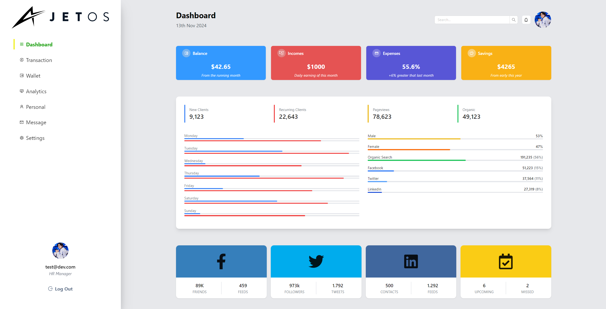

# Admin Dashboard

This project is an admin dashboard web application built using **React** with **Tailwind CSS** and **Ant Design** for styling and layout. The dashboard includes features such as a sidebar menu that sticks to the right side with full height and a responsive layout for various types of analytics data.



## Features

- **Responsive Layout**: The dashboard adapts to different screen sizes, ensuring optimal user experience across devices.
- **Right-Side Sidebar**: A sidebar menu that sticks to the right side and spans the full height of the screen.
- **Styled with Tailwind CSS and Ant Design**: Uses modern styling libraries to ensure a clean and professional look.
- **Analytics Visualization**: Displays sample data such as new and recurring clients, pageviews, and other metrics.

## Technologies Used

- **React**: JavaScript library for building the user interface.
- **Tailwind CSS**: Utility-first CSS framework for styling.
- **Ant Design**: UI component library to enhance UI elements.
- **TypeScript**: (Optional) If used, add "for static typing."

## Installation

To set up the project locally:

1. **Clone the repository**:

    ```bash
    git clone https://github.com/yourusername/admin-dashboard.git
    cd admin-dashboard
    ```

2. **Install dependencies**:

    ```bash
    npm install
    ```

3. **Set up environment variables**:

   Create a `.env` file in the root directory and add any necessary environment variables (e.g., API keys).

4. **Run the development server**:

    ```bash
    npm start
    ```

    Open [http://localhost:3000](http://localhost:3000) to view the dashboard in the browser.

## Usage

The dashboard allows you to:

- **Navigate between different sections** in the sidebar (e.g., Analytics, Personal, Messages, Settings).
- **View analytics data** displayed in visually organized components.
  
Customize or add more features based on your needs by modifying the components in the `src/components` folder.

## Components

- **Sidebar**: Displays the main navigation menu, which sticks to the right side of the page with full screen height.
- **Dashboard**: Shows analytics data in visually engaging charts and tables.

## Styling

- **Tailwind CSS**: Utility classes are used throughout the project for consistent, responsive design.
- **Ant Design**: Provides ready-to-use components for sidebar, tables, and other UI elements.

## Customization

To modify the sidebar:

1. Go to `src/components/Sidebar.tsx`.
2. Update the menu items and styles as needed.

To adjust the dashboard layout:

1. Go to `src/components/Dashboard.tsx`.
2. Modify or add new data visualization components as required.

## License

This project is licensed under the MIT License. See the [LICENSE](LICENSE) file for more details.

## Acknowledgements

- [React](https://reactjs.org/)
- [Tailwind CSS](https://tailwindcss.com/)
- [Ant Design](https://ant.design/)
